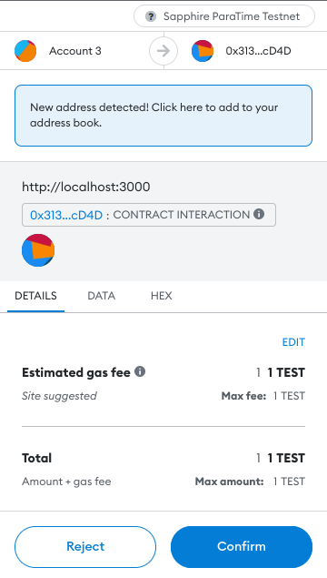

# Browser Support

Confidential Sapphire dApps work in web browsers by wrapping the
Ethereum provider such as Metamask to enable signing and encrypting
calls and transactions.

Let's begin with the [Hardhat boilerplate]. As mentioned on their website
the boilerplate provides the following:

- The Solidity contract implementing an ERC-20 token
- Tests for the entire functionality of the contract
- A minimal React front-end to interact with the contract using ethers.js

Go ahead and clone the original [Hardhat boilerplate repo]. Move to the checked
out folder and **apply the Sapphire-specific changes** to `hardhat.config.js`
as [described in the quickstart][quickstart].

Next, install dependencies. The boilerplate project uses
[pnpm], but `yarn` and `npm` will also work with some modifications
around workspaces:

```shell npm2yarn
npm install
npm install -D @oasisprotocol/sapphire-paratime
```

Now, you can deploy the contract on the Testnet with the private key of the
account holding some [TEST tokens]:

```shell
PRIVATE_KEY="0x..." npx hardhat run scripts/deploy.js --network sapphire-testnet
```

This will compile the contract and deploy it on the Testnet. In addition
to the quickstart steps, **the contract address and ABI will also automatically
be copied over to the `frontend/src/contracts` folder so that the frontend can
access them!**

:::warning

The contract in the Hardhat boilerplate is ERC-20-compatible and emits the
`transfer` event. If your wish to preserve confidentiality, you can comment
out [line 66]. Read [the guide](guide.mdx#contract-logs) to learn more.

:::

[`wagmi`]: https://wagmi.sh/
[`viem`]: https://viem.sh/

## Signing Sapphire Calls and Transactions in Browser

Now, let's explore the frontend of our dApp. Begin by moving into the
`frontend` folder and install dependencies:

```shell npm2yarn
npm install
npm install -D @oasisprotocol/sapphire-paratime
```

The main frontend logic is stored in `frontend/src/components/Dapp.js`. Apply
the following changes:

```diff title="frontend/src/components/Dapp.js"
--- a/hardhat-boilerplate/frontend/src/components/Dapp.js
+++ b/hardhat-boilerplate/frontend/src/components/Dapp.js
@@ -2,6 +2,7 @@

 // We'll use ethers to interact with the Ethereum network and our contract
 import { ethers } from "ethers";
+import * as sapphire from '@oasisprotocol/sapphire-paratime';

 // We import the contract's artifacts and address here, as we are going to be
 // using them with ethers
@@ -22,7 +23,7 @@
 // This is the Hardhat Network id that we set in our hardhat.config.js.
 // Here's a list of network ids https://docs.metamask.io/guide/ethereum-provider.html#properties
 // to use when deploying to other networks.
-const HARDHAT_NETWORK_ID = '1337';
+const HARDHAT_NETWORK_ID = '23295'; // Sapphire Testnet

 // This is an error code that indicates that the user canceled a transaction
 const ERROR_CODE_TX_REJECTED_BY_USER = 4001;
@@ -225,14 +226,20 @@

   async _initializeEthers() {
     // We first initialize ethers by creating a provider using window.ethereum
-    this._provider = new ethers.providers.Web3Provider(window.ethereum);
+    this._provider = sapphire.wrap(new ethers.providers.Web3Provider(window.ethereum));

-    // Then, we initialize the contract using that provider and the token's
-    // artifact. You can do this same thing with your contracts.
+    // Then, we initialize two contract instances:
+    // - _token: Used for eth_calls (e.g. balanceOf, name, symbol)
+    // - _tokenWrite: Used for on-chain transactions (e.g. transfer)
     this._token = new ethers.Contract(
       contractAddress.Token,
       TokenArtifact.abi,
-      this._provider.getSigner(0)
+      this._provider,
+    );
+    this._tokenWrite = new ethers.Contract(
+      contractAddress.Token,
+      TokenArtifact.abi,
+      this._provider.getSigner()
     );
   }

@@ -294,7 +301,7 @@

       // We send the transaction, and save its hash in the Dapp's state. This
       // way we can indicate that we are waiting for it to be mined.
-      const tx = await this._token.transfer(to, amount);
+      const tx = await this._tokenWrite.transfer(to, amount);
       this.setState({ txBeingSent: tx.hash });

       // We use .wait() to wait for the transaction to be mined. This method
@@ -360,8 +367,8 @@
       return true;
     }

-    this.setState({
-      networkError: 'Please connect Metamask to Localhost:8545'
+    this.setState({
+      networkError: 'Please connect to Sapphire ParaTime Testnet'
     });

     return false;
```

Beside the obvious change to the chain ID and wrapping ethers.js objects with the
Sapphire wrapper you can notice that we initialized **two** contract
instances:

- `this._token` object will be used for unsigned eth calls. This is the
  Hardhat method of [setting `from` transaction field to all
  zeros][guide-transaction-calls] in order to avoid Metamask signature popups.
  Although the call is unsigned, **it is still encrypted** with the
  corresponding runtime key to preserve confidentiality.
- `this._tokenWrite` object will be used for signed calls and transactions. The
  user will be prompted by Metamask for the signature. Both — calls and
  transactions — will be encrypted.

## Trying it

Start the frontend by typing:

```shell npm2yarn
npm run start
```

If all goes well the web server will spin up and your browser should
automatically open `http://localhost:3000`.


Go ahead and connect the wallet. If you haven't done it yet, you will have
to add the [Sapphire ParaTime Testnet network to your
Metamask][sapphire-testnet]. Once connected, the frontend will make an unsigned
call to the `balanceOf` view and show you the amount of `MHT`s in your selected
Metamask account.


Next, let's transfer some `MHT`s. Fill in the amount, the address and hit the
*Transfer* button. Metamask will show you the popup to sign and submit the
transfer transaction. Once confirmed, Metamask will both **sign and encrypt** the transaction.



Once the transaction is processed, you will get a notification from Metamask
and the balance in the dApp will be updated.

:::tip

If you commented out `emit Transfer(...)`, the transfer of `MHT`s would have
been completely confidential. In the example above, the [following
transaction][block explorer] was generated. Go ahead and check your transaction
on the block explorer too, to make sure no sensitive data was leaked!

:::

Congratulations, you successfully implemented your first truly confidential
dApp which runs in the browser and wraps Metamask to both sign and encrypt the
transactions!

Should you have any questions or ideas to share, feel free to reach out to us
on [discord and other social media channels][social-media].

:::info Example: Hardhat boilerplate

You can download a full working example from the [Sapphire ParaTime examples]
repository.

:::

:::info Example: Starter project

If your project involves building both a contract backend and a web frontend,
we recommend that you check out the official [Oasis starter] files.

[Oasis starter]: https://github.com/oasisprotocol/demo-starter

:::

[block explorer]: https://explorer.oasis.io/testnet/sapphire/tx/0x3303dea5d48291d1564cad573f21fc71fcbdc2b862e17e056287fd9207e3bc53
[guide-transaction-calls]: guide.mdx#transactions--calls
[Hardhat boilerplate repo]: https://github.com/NomicFoundation/hardhat-boilerplate
[Hardhat boilerplate]: https://hardhat.org/tutorial/boilerplate-project
[Hardhat tutorial]: https://hardhat.org/tutorial
[line 66]: https://github.com/NomicFoundation/hardhat-boilerplate/blob/13bd712c1285b2de572f14d20e6a750ae08565c0/contracts/Token.sol#L66
[quickstart]: quickstart.mdx#add-the-sapphire-testnet-to-hardhat
[sapphire-testnet]: ./network.mdx#testnet
[Sapphire ParaTime examples]: https://github.com/oasisprotocol/sapphire-paratime/tree/main/examples/hardhat-boilerplate
[social-media]: https://github.com/oasisprotocol/docs/blob/main/docs/get-involved/README.md#social-media-channels
[pnpm]: https://pnpm.io
[TEST tokens]: quickstart.mdx#get-some-sapphire-testnet-tokens
