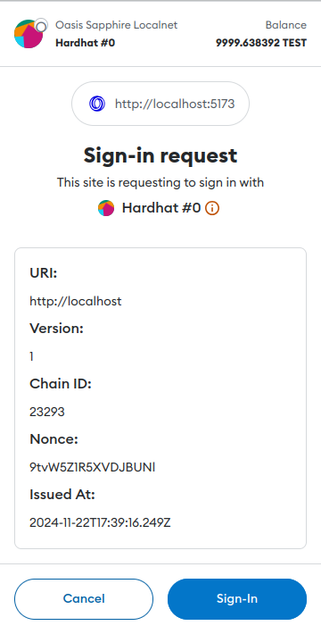
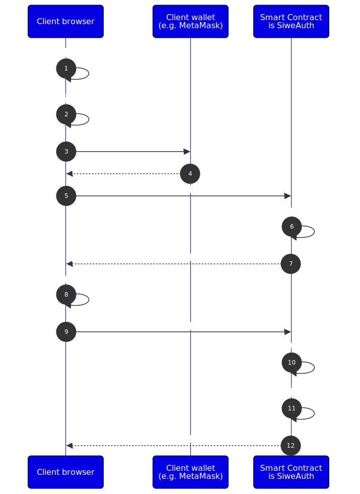

import Tabs from '@theme/Tabs';
import TabItem from '@theme/TabItem';

# View-Call Authentication

User impersonation on Ethereum and other "transparent EVMs" isn't a problem
because **everybody** can see **all** data. However, the Sapphire confidential
EVM prevents contracts from revealing confidential information to the wrong
party (account or contract)—for this reason we cannot allow arbitrary
impersonation of any `msg.sender`.

In Sapphire, you need to consider the following types of contract calls:

1. **Contract to contract calls** (also known as *internal calls*)
  
    `msg.sender` is set to the address corresponding to the caller function. If
    a contract calls another contract in a way which could reveal sensitive
    information, the calling contract must implement access control or
    authentication.

2. **Unauthenticted view calls** (queries using `eth_call`)

    `eth_call` queries used to invoke contract functions will always have the
    `msg.sender` parameter set to `address(0x0)` on Sapphire. This is regardless
    of any `from` overrides passed on the client side for simulating the query.
   
   :::note

   Calldata end-to-end encryption has nothing to do with authentication.
   Although the calls may be unauthenticated they can still be encrypted, and
   the other way around!

   :::

3. **Authenticated view calls** (via SIWE token)

    Developer authenticates the view call explicitly by deriving a message
    sender from the SIWE token. This token is provided as a separate parameter
    to the contract function. The derived address can then be used for
    authentication in place of `msg.sender`. Otherwise, such view call behaves
    the same way as the unauthenticated view calls above and built-in
    `msg.sender` is `address(0x0)`. This approach is most appropriate for 
    frontend dApps.

4. **Authenticated view calls** (via signed queries)

    [EIP-712] defines a format for signing view calls with the keypair of your
    Ethereum account. Sapphire will validate such signatures and automatically
    set the `msg.sender` parameter in your contract to the address of the
    signing account. This method is most appropriate for backend services
    because frontend applications would require user interaction each time.

5. **Transactions** (authenticated by signature)

    When a transaction is submitted it is signed by a keypair (thus costs gas
    and can make state updates) and the `msg.sender` will be set to the address of
    the signing account.

[EIP-712]: https://eips.ethereum.org/EIPS/eip-712

## How Sapphire Executes Contract Calls

Let's see how Sapphire executes contract calls for each call variant presented
above. Consider the following Solidity code:

```solidity
contract Example {
    address _owner;
    constructor () {
        _owner = msg.sender;
    }
    function isOwner() public view returns (bool) {
        return msg.sender == _owner;
    }
}
```

In the sample above, assuming we're calling from the same contract or account
which created the contract, calling `isOwner` will return:

1. `true`, if called via the contract which created it
2. `false`, for unauthenticated `eth_call`
3. `false`, since the contract has no SIWE implementation
4. `true`, for signed view call using the wrapped client ([Go][wrapped-go],
   [Python][wrapped-py]) with signer attached
5. `true`, if called via transaction

Now that we've covered basics, let's look more closely at the *authenticated
view calls*. These are crucial for building confidential smart contracts on
Sapphire.

## Authenticated view calls

Consider this slightly extended version of the contract above. Only the owner is
allowed to store and retrieve secret message:

```solidity
contract MessageBox {
    address private _owner;
    string private _message;

    modifier onlyOwner() {
        if (msg.sender != _owner) {
            revert("not allowed");
        }
        _;
    }
    constructor() {
        _owner = msg.sender;
    }

    function getSecretMessage() external view onlyOwner returns (string memory) {
        return _message;
    }

    function setSecretMessage(string calldata message) external onlyOwner {
        _message = message;
    }
}
```

### via SIWE token

SIWE stands for "Sign-In with Ethereum" and is formally defined in [EIP-4361].
The initial use case for SIWE involved using your Ethereum account as a form of
authentication for off-chain services (providing an alternative to user names
and passwords). The MetaMask wallet quickly adopted the standard and it became a
de-facto login mechanism in the Web3 world. An informative pop-up for logging
into a SIWE-enabled website looks like this:



After a user agrees by signing the SIWE login message above, the signature is
verified by the website backend or by a 3rd party [single sign-on] service. This
is done only once per session—during login. A successful login generates a token
that is used for the remainder of the session.

In contrast to transparent EVM chains, **Sapphire simplifies dApp design,
improves trust, and increases the usability of SIWE messages through extending
message parsing and verification to on-chain computation**. This feature (unique
to Sapphire) removes the need to develop and maintain separate dApp backend
services just for SIWE authentication. Let's take a look at an example
authentication flow:



Consider the `MessageBox` contract from [above](#authenticated-view-calls), and
let's extend it with [SiweAuth]:

```solidity
import {SiweAuth} from "@oasisprotocol/sapphire-contracts/contracts/auth/SiweAuth.sol";

contract MessageBox is SiweAuth {
  address private _owner;
  string private _message;

  modifier onlyOwner(bytes memory token) {
    if (msg.sender != _owner && authMsgSender(token) != _owner) {
        revert("not allowed");
    }
    _;
  }

  constructor(string memory domain) SiweAuth(domain) {
    _owner = msg.sender;
  }

  function getSecretMessage(bytes memory token) external view onlyOwner(token) returns (string memory) {
    return _message;
  }

  function setSecretMessage(string calldata message) external onlyOwner(bytes("")) {
    _message = message;
  }
}
```

We made the following changes:

1. In the constructor, we need to define the domain name where the dApp frontend
   will be deployed. This domain is included inside the SIWE log-in message
   and is verified by the user-facing wallet to make sure they are accessing the
   contract from a legitimate domain.
2. The `onlyOwner` modifier is extended with an optional `bytes memory token`
   parameter and is considered in the case of invalid `msg.sender` value. The
   same modifier is used for authenticating both SIWE queries and the
   transactions.
3. `getSecretMessage` was extended with the `bytes memory token` session token.

On the client side, the code running inside a browser needs to make sure that
the session token for making authenticated calls is valid. If not, the browser
requests a wallet to sign a log-in message and fetch a fresh session token.

```typescript
import {SiweMessage} from 'siwe';
import { ethers } from 'hardhat'

let token = '';

async function getSecretMessage(): Promise<Message> {
  const messageBox = await ethers.getContractAt('MessageBox', '0x5FbDB2315678afecb367f032d93F642f64180aa3');

  if (token == '') { // Stored in browser session.
    const domain = await messageBox.domain();
    const siweMsg = new SiweMessage({
      domain,
      address: addr, // User's selected account address.
      uri: `http://${domain}`,
      version: "1",
      chainId: 0x5afe, // Sapphire Testnet
    }).toMessage();
    const sig = ethers.Signature.from((await window.ethereum.getSigner(addr)).signMessage(siweMsg));
    token = await messageBox.login(siweMsg, sig);
  }

  return messageBox.getSecretMessage(token);
}
```

:::info Example: Starter project

To see a running example of the TypeScript SIWE code including the Hardhat
tests, Node.js and the browser, check out the official Oasis [demo-starter]
project. The SIWE authentication is implemented inside the [Hardhat tests].

:::

:::tip Sapphire TypeScript wrapper?

While the [Sapphire TypeScript wrapper][sp-npm] offers a convenient end-to-end
encryption for the contract calls, it is not mandatory for SIWE, if you trust
your Web3 endpoint.

:::

[demo-starter]: https://github.com/oasisprotocol/demo-starter
[Hardhat tests]: https://github.com/oasisprotocol/demo-starter/blob/master/backend/test/MessageBox.ts
[SiweAuth]: https://api.docs.oasis.io/sol/sapphire-contracts/contracts/auth/SiweAuth.sol/contract.SiweAuth.html
[EIP-4361]: https://eips.ethereum.org/EIPS/eip-4361
[single sign-on]: https://en.wikipedia.org/wiki/Single_sign-on
[sp-npm]: https://www.npmjs.com/package/@oasisprotocol/sapphire-paratime

### via signed queries

:::info

Sapphire TypeScript wrapper v1 included signed view calls which resulted in
MetaMask popups for every view call. We recommend authenticating [via SIWE token]
with the Sapphire TypeScript wrapper v2 going forward.

:::

[via SIWE token]: #via-siwe-token

[EIP-712] proposed a method to show data to the user in a structured fashion so
they can verify it before signing. In the browser however, apps requiring signed
view calls would trigger user interaction with their wallet each time—sometimes
even multiple times per page—which is bad UX that frustrates users. Backend
services on the other hand often have direct access to an Ethereum wallet (e.g.
a secret key stored in the environment variable) without needing user
interaction. This is possible because a backend service connects to a trusted
site and executes trusted code, so it's fine to sign the necessary view calls
non interactively.

The Sapphire wrappers for [Go][sp-go] and [Python][sp-py] will **sign any view
call** you make to a contract deployed on Sapphire using the aforementioned
[EIP-712]. Suppose we want to store the private key of an account used to sign
the view calls inside a `PRIVATE_KEY` environment variable. The following
snippets demonstrate how to trigger signed queries **without any changes to the
original `MessageBox` contract from [above](#authenticated-view-calls)**.

[sp-go]: https://github.com/oasisprotocol/sapphire-paratime/tree/main/clients/go
[sp-py]: https://github.com/oasisprotocol/sapphire-paratime/tree/main/clients/py

[wrapped-go]: https://pkg.go.dev/github.com/oasisprotocol/sapphire-paratime/clients/go#WrapClient
[wrapped-py]: https://api.docs.oasis.io/py/sapphirepy/sapphirepy.html#sapphirepy.sapphire.wrap

<Tabs>
    <TabItem value="Go">
    Wrap the existing Ethereum client by calling the
    [`WrapClient()`][wrapped-go] helper and provide the signing logic. Then,
    all subsequent view calls will be signed. For example:

```go
import (
    "context"
    "crypto/ecdsa"

    "github.com/ethereum/go-ethereum/accounts/abi/bind"
    "github.com/ethereum/go-ethereum/common"
    "github.com/ethereum/go-ethereum/crypto"
    "github.com/ethereum/go-ethereum/ethclient"
    
    sapphire "github.com/oasisprotocol/sapphire-paratime/clients/go"

    messageBox "demo-starter/contracts/message-box"
)

func GetC10lMessage() (string, error) {
    client, err = ethclient.Dial("https://testnet.sapphire.oasis.io")
    if err != nil {
        return "", err
    }
	
    sk, err = crypto.HexToECDSA(os.Getenv("PRIVATE_KEY"))
    addr := crypto.PubkeyToAddress(*sk.Public().(*ecdsa.PublicKey))

    wrappedClient, err := sapphire.WrapClient(c.Client, func(digest [32]byte) ([]byte, error) {
        return crypto.Sign(digest[:], sk)
    })
    if err != nil {
        return "", fmt.Errorf("unable to wrap backend: %v", err)
    }

    mb, err := messageBox.NewMessageBox(common.HexToAddress("0x5FbDB2315678afecb367f032d93F642f64180aa3"), wrappedClient)
    if err != nil {
        return "", fmt.Errorf("Unable to get instance of contract: %v", err)
    }
	
    msg, err := mb.GetSecretMessage(&bind.CallOpts{From: addr}) // Don't forget to pass callOpts!
    if err != nil {
        return "", fmt.Errorf("failed to retrieve message: %v", err)
    }
	
    return msg, nil
}
```

    :::info Example: Oasis starter in Go

    To see a running example of the Go code including the end-to-end encryption
    and signed queries check out the official [Oasis starter project for Go].

    :::
    </TabItem>
    <TabItem value="Python">
    Wrap the existing Web3 client by calling the
    [`wrap()`][wrapped-py] helper and provide the signing logic. Then,
    all subsequent view calls will be signed. For example:

```python
from web3 import Web3
from web3.middleware import construct_sign_and_send_raw_middleware
from eth_account.signers.local import LocalAccount
from eth_account import Account

from sapphirepy import sapphire

def get_c10l_message(address: str, network_name: Optional[str] = "sapphire-localnet") -> str:
    w3 = Web3(Web3.HTTPProvider(sapphire.NETWORKS[network_name]))
    account: LocalAccount = Account.from_key(os.environ.get("PRIVATE_KEY"))
    w3.middleware_onion.add(construct_sign_and_send_raw_middleware(account))
    w3 = sapphire.wrap(w3, account)
    
    compiled_contract = json.load("MessageBox_compiled.json")
    contract_data = compiled_contract["contracts"]["MessageBox.sol"]["MessageBox"]
    message_box = w3.eth.contract(address=address, abi=contract_data["abi"])
    
    return message_box.functions.message().call()
```

    :::info Example: Oasis starter in Python

    To see a running example of the Python code including the end-to-end
    encryption and signed queries, check out the official [Oasis starter project
    for Python].

    :::
    </TabItem>
</Tabs>

:::tip

If your smart contract needs to support view calls from both the frontend and
the backend, then take the [SIWE approach](#via-siwe-token). The backend
implementation then depends on your programming language:

- **Go and Python**: Pass an empty string as a `token` parameter to your smart
  contract and let the wrapper sign the view call using EIP-712. Since
  `msg.sender` will be defined, the `isOwner` modifier will pass just fine.
- **TypeScript**: Recycle the frontend client-side code
  [from above](#via-siwe-token) to generate the SIWE message, perform the 
  authentication and pass it in the view call.

[Oasis starter project for Go]: https://github.com/oasisprotocol/demo-starter-go
[Oasis starter project for Python]: https://github.com/oasisprotocol/demo-starter-py
