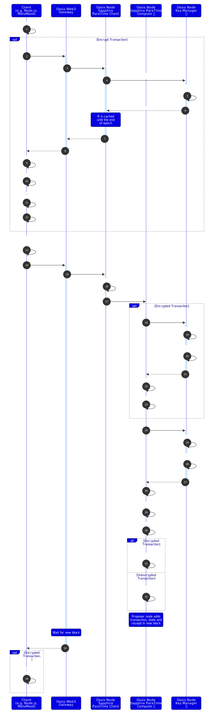
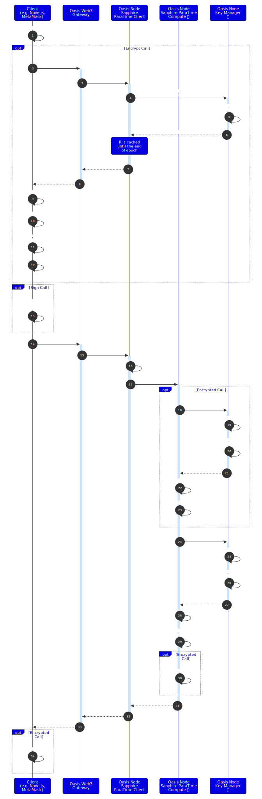

import DocCard from '@theme/DocCard';
import {findSidebarItem} from '@site/src/sidebarUtils';

# Concepts

## Transactions & Calls

{/*-- https://github.com/oasisprotocol/docs/blob/455980674563cad92ff1e1b62a7a5f2d4d6809f0/docs/general/images/architecture/client-km-compute.svg -->*/}

The figure above illustrates the flow of a **confidential smart contract
transaction** on Sapphire.

Transactions and calls must be encrypted and signed for maximum security.
The [@oasisprotocol/sapphire-paratime] npm package will make your life
easy. It'll handle cryptography and signing for you.

You should be aware that taking actions based on the value of private data may
**leak the private data through side channels** like time spent, gas use and
accessed memory locations. If you need to branch on private data, you should in
most cases ensure that both branches exhibit the same time/gas and storage
patterns.

You can also make **confidential smart contract calls** on Sapphire. If you
use `msg.sender` for access control in your contract, the call **must be
signed**, otherwise `msg.sender` will be zeroed. On the other hand, set the
`from` address to all zeros, if you want to avoid annoying signature popups in
the user's wallet for calls that do not need to be signed. The JS library will
do this for you.

[@oasisprotocol/sapphire-paratime]: https://www.npmjs.com/package/@oasisprotocol/sapphire-paratime

:::note

Inside the smart contract code, there is no way of knowing whether the
client's call data were originally encrypted or not.

:::

  
Detailed confidential smart contract transaction flow on Sapphire

  
Detailed confidential smart contract call flow on Sapphire

## Contract State

The Sapphire state model is like Ethereum's except for all state being encrypted
and not accessible to anyone except the contract. The contract, executing in an
active (attested) Oasis compute node is the only entity that can request its
state encryption key from the Oasis key manager. Both the keys and values of the
items stored in state are encrypted, but the **size of either is not hidden**. Your
app may need to pad state items to a constant length, or use other obfuscation.
Observers may also be able to infer computation based on storage access patterns,
so you may need to obfuscate that, too. See [Security chapter] for more
recommendations.

[Security chapter]: ./security.md#storage-access-patterns

:::danger Contract state leaks a fine-grained access pattern

Contract state is backed by an encrypted key-value store. However, the trace of
encrypted records is leaked to the compute node. As a concrete example, an ERC-20
token transfer would leak which encrypted record is for the sender's account
balance and which is for the receiver's account balance. Such a token would be
traceable from sender address to receiver address. Obfuscating the storage access
patterns may be done by using an ORAM implementation.

:::

Contract state may be made available to third parties through logs/events, or
explicit getters.

## Contract Logs

Contract logs/events (e.g., those emitted by the Solidity `emit` keyword)
are exactly like Ethereum. Data contained in events is *not* encrypted.
Precompiled contracts are available to help you encrypt data that you can
then pack into an event, however.

:::danger Unmodified contracts may leak state through logs

Base contracts like those provided by OpenZeppelin often emit logs containing
private information. If you don't know they're doing that, you might undermine
the confidentiality of your state. As a concrete example, the ERC-20 spec
requires implementers to emit an `event Transfer(from, to, amount)`, which is
obviously problematic if you're writing a confidential token. What you can
do instead is fork that contract and remove the offending emissions.

:::

:::tip Encrypted events

To keep event payloads confidential while retaining indexability and triggers, see [Encrypted Events](./encrypted-events.mdx).

:::

## See also

<DocCard item={findSidebarItem('/build/sapphire/ethereum')} />
