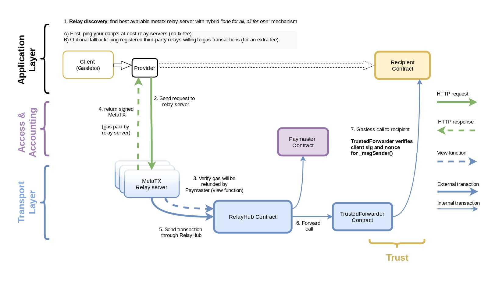

# Gasless Transactions

When you submit a transaction to a blockchain, you need to pay certain fee
(called *gas* in Ethereum jargon). Since only the transactions with the highest
fee will be included in the block, this mechanism effectively prevents denial
of service attacks on the network. On the other hand, paying for gas requires
from the user that they have certain amount of blockchain-native tokens
available in their wallet which may not be feasible.

In this chapter we will learn how the user signs and sends their transaction to
a *relayer*. The relayer then wraps the original signed transaction into a new
*meta-transaction* (see [ERC-2771] for details), signs it and pays for the
necessary transaction fees. When the transaction is submitted the on-chain
recipient contract decodes the meta-transaction, verifies both signatures and
executes the original transaction.

Oasis Sapphire supports two transaction relaying methods: The **on-chain
signer** is trustless and utilizes the Oasis-specific contract state encryption
while the **gas station network** service is known from other blockchains as
well.

:::caution

The gas station network implementation on Sapphire is still in early beta. Some
features such as the browser support are not fully implemented yet.

:::

[ERC-2771]: https://eips.ethereum.org/EIPS/eip-2771

## On-Chain Signer

The on-chain signer is a smart contract which:

1. receives the user's transaction,
2. checks whether the transaction is valid,
3. wraps it into a meta-transaction (which includes paying for the transaction
   fee) and
4. returns it back to the user in the [EIP-155] format.

The steps above are executed as a confidential read-only call. Finally, the user
then submits the obtained transaction to the network.


### EIP155Signer

To sign a transaction, the Sapphire's `EIP155Signer` library bundled along the
`@oasisprotocol/sapphire-contract` package comes with the following helper which
returns a raw, RLP-encoded, signed transaction ready to be broadcast:

```solidity
function sign(address publicAddress, bytes32 secretKey, EthTx memory transaction) internal view returns (bytes memory);
```

`publicAddress` and `secretKey` are the signer's address and their private key
used to sign a meta-transaction (and pay for the fees). We will store these
sensitive data inside the encrypted smart contract state together with the
signer's `nonce` field in the following struct:

```solidity
struct EthereumKeypair {
  address addr;
  bytes32 secret;
  uint64 nonce;
}
```

The last `transaction` parameter in the `sign()` function is the transaction
encoded in a format based on [EIP-155]. This can either be the original user's
transaction or a meta-transaction.

### Gasless Proxy Contract

The following snippet is a complete *Gasless* contract for wrapping the user's
transactions (`makeProxyTx()`) and executing them (`proxy()`). The signer's
private key containing enough balance to cover transaction fees should be
provided in the constructor.

```solidity
import { encryptCallData } from "@oasisprotocol/sapphire-contracts/contracts/CalldataEncryption.sol";
import { EIP155Signer } from "@oasisprotocol/sapphire-contracts/contracts/EIP155Signer.sol";

struct EthereumKeypair {
  address addr;
  bytes32 secret;
  uint64 nonce;
}

struct EthTx {
  uint64 nonce;
  uint256 gasPrice;
  uint64 gasLimit;
  address to;
  uint256 value;
  bytes data;
  uint256 chainId;
}

// Proxy for gasless transaction.
contract Gasless {
  EthereumKeypair private kp;

  function setKeypair(EthereumKeypair memory keypair) external payable {
    kp = keypair;
  }

  function makeProxyTx(address innercallAddr, bytes memory innercall)
  external
  view
  returns (bytes memory output)
  {
    bytes memory data = abi.encode(innercallAddr, innercall);

    // Call will invoke proxy().
    return
      EIP155Signer.sign(
        kp.addr,
        kp.secret,
        EIP155Signer.EthTx({
          nonce: kp.nonce,
          gasPrice: 100_000_000_000,
          gasLimit: 250000,
          to: address(this),
          value: 0,
          data: encryptCallData(abi.encodeCall(this.proxy, data)),
          chainId: block.chainid
        })
      );
  }

  function proxy(bytes memory data) external payable {
    (address addr, bytes memory subcallData) = abi.decode(
      data,
      (address, bytes)
    );
    (bool success, bytes memory outData) = addr.call{value: msg.value}(
      subcallData
    );
    if (!success) {
      // Add inner-transaction meaningful data in case of error.
      assembly {
        revert(add(outData, 32), mload(outData))
      }
    }
    kp.nonce += 1;
  }
}
```

:::tip

The snippet above only runs on Sapphire Mainnet, Testnet or Localnet.
[`EIP155Signer.sign()`] is not supported on other EVM chains.

:::

[`EIP155Signer.sign()`]: https://api.docs.oasis.io/sol/sapphire-contracts/contracts/EIP155Signer.sol/library.EIP155Signer.html#sign

### Simple Gasless Commenting dApp

Let's see how we can implement on-chain signer for a gasless commenting dApp
like this:

```solidity
contract CommentBox {
  string[] public comments;

  function comment(string memory commentText) external {
    comments.push(commentText);
  }
}
```

Then, the TypeScript code on a client side for submitting a comment in a gasless
fashion would look like this:

```typescript
const CommentBox = await ethers.getContractFactory("CommentBox");
const commentBox = await CommentBox.deploy();
await commentBox.waitForDeployment();
const Gasless = await ethers.getContractFactory("Gasless");
const gasless = await Gasless.deploy();
await gasless.waitForDeployment();

// Set the keypair used to sign the meta-transaction.
await gasless.setKeypair({
  addr: "70997970C51812dc3A010C7d01b50e0d17dc79C8",
  secret: Uint8Array.from(Buffer.from("59c6995e998f97a5a0044966f0945389dc9e86dae88c7a8412f4603b6b78690d", 'hex')),
  nonce: 0,
});

const innercall = commentBox.interface.encodeFunctionData('comment', ['Hello, free world!']);
const tx = await gasless.makeProxyTx(commentBox.address, innercall);

const plainProvider = new ethers.JsonRpcProvider(ethers.provider.connection);
const plainResp = await plainProvider.sendTransaction(tx);

const receipt = await ethers.provider.getTransactionReceipt(plainResp.hash);
if (!receipt || receipt.status != 1) throw new Error('tx failed');
```

:::example On-Chain Signer

You can download a complete on-chain signer example based on the above snippets
from the [Sapphire ParaTime examples] repository.

:::

[Sapphire ParaTime examples]:
  https://github.com/oasisprotocol/sapphire-paratime/tree/main/examples/onchain-signer

### Gasless Proxy in Production

The snippets above have shown how the on-chain signer can generate and sign a
meta-transaction for arbitrary transaction. In production environment however,
you must consider the following:

#### Confidentiality

The [`encryptCallData()`] helper above will generate an ephemeral key and encrypt
the transaction's calldata. Omit this call to generate a plain transaction. You
can also explicitly encrypt specific function arguments of the inner-transaction
by calling [`Sapphire.encrypt()`] using a private key stored somewhere in your
smart contract and then [`Sapphire.decrypt()`] when executing the transaction.

[`encryptCallData()`]: https://api.docs.oasis.io/sol/sapphire-contracts/contracts/CalldataEncryption.sol/function.encryptCallData.html#encryptcalldatabytes
[`Sapphire.encrypt()`]: https://api.docs.oasis.io/sol/sapphire-contracts/contracts/Sapphire.sol/library.Sapphire.html#encrypt-1
[`Sapphire.decrypt()`]: https://api.docs.oasis.io/sol/sapphire-contracts/contracts/Sapphire.sol/library.Sapphire.html#decrypt-1

#### Gas Cost and Gas Limit

The gas cost and the gas limit in our snippet were hardcoded inside the
contract. Ideally the gas cost should be dynamically adjusted by an oracle and
the gas limit determined based on the type of transactions. **Never let gas cost
and limit to be freely defined by the user, since they can drain your relayer's
account.**

#### Allowed Transactions

Your relayer will probably be used for transactions of a specific contract only.
One approach is to store the allowed address of the target contract and **only
allow calls to this contract address**.

#### Access Control

You can either whitelist specific addresses of the users in the relayer contract
or implement the access control in the target contract. In the latter case, the
relayer's `makeProxyTx()` should simulate the execution of the inner-transaction
and generate the meta-transaction only if it inner-transaction succeeded.

#### Multiple Signers

Only one transaction per block can be relayed by the same signer since the order
of the transactions is not deterministic and nonces could mismatch. To overcome
this, relayer can randomly pick a signer from the **pool of signers**. When the
transaction is relayed, don't forget to reimburse the signer of the transaction!

:::example Voting dApp

All the above points are considered in the [Demo Voting dApp][demo-voting].
You can explore the code and also try out a deployed gasless version of the
voting dApp on the [Oasis Playground site][demo-voting-playground]. The access
control list is configured so that anyone can vote on any poll and only poll
creators can close the poll.

:::

[demo-voting]: https://github.com/oasisprotocol/demo-voting
[demo-voting-playground]: https://playground.oasis.io/demo-voting
[EIP-155]: https://github.com/ethereum/EIPs/blob/master/EIPS/eip-155.md

## Gas Station Network

[Gas Station Network](https://docs.opengsn.org) (GSN) was adapted to work with
Sapphire in a forked `@oasislabs/opengsn-cli` package. The diagram below
illustrates a flow for signing a transaction by using a GSN[^1].



[^1]: The GSN flow diagram is courtesy of [OpenGSN documentation][opengsn-docs].

[opengsn-docs]: https://github.com/opengsn/docs

### Package Install

Starting with an empty folder, let us install the
[Oasis fork of the GSN command line tool](https://github.com/oasislabs/gsn) by
using the following commands:

```shell npm2yarn
npm init
npm install -D @oasislabs/opengsn-cli
```

Next, we will export our hex-encoded private key (**without** the leading `0x`)
for deploying the gas station network as an environment variable:

```shell
export PRIVATE_KEY=...
```

### Deploy GSN

Deploy GSN relaying contracts along with the test paymaster using a
test token. Use the address of your account as `--burnAddress` and
`--devAddress` parameters:

```shell
npx gsn deploy --network sapphire-testnet --burnAddress 0xfA3AC9f65C9D75EE3978ab76c6a1105f03156204 --devAddress 0xfA3AC9f65C9D75EE3978ab76c6a1105f03156204 --testToken true --testPaymaster true --yes --privateKeyHex $PRIVATE_KEY
```

After the command finishes successfully, you should find the addreses of
deployed contracts at the end:

```
  Deployed TestRecipient at address 0x594cd6354b23A5200a57355072E2A5B15354ee21
  
  RelayHub: 0xc4423AB6133B06e4e60D594Ac49abE53374124b3 
  RelayRegistrar: 0x196036FBeC1dA841C60145Ce12b0c66078e141E6
  StakeManager: 0x6763c3fede9EBBCFbE4FEe6a4DE6C326ECCdacFc
  Penalizer: 0xA58A0D302e470490c064EEd5f752Df4095d3A002
  Forwarder: 0x59001d07a1Cd4836D22868fcc0dAf3732E93be81
  TestToken (test only): 0x6Ed21672c0c26Daa32943F7b1cA1f1d0ABdbac66
  Paymaster (Default): 0x8C06261f58a024C958d42df89be7195c8690008d
```


### Start GSN Relay Server

Now we are ready to start our own relay server by using the following command.
Use the newly deployed:

- `RelayHub` address for `--relayHubAddress`,
- `TestToken` address for `--managerStakeTokenAddress`,
- address of your account for `--owner-address`

```shell
npx gsn relayer-run --relayHubAddress 0xc4423AB6133B06e4e60D594Ac49abE53374124b3 --managerStakeTokenAddress  0x6Ed21672c0c26Daa32943F7b1cA1f1d0ABdbac66 --ownerAddress '0xfA3AC9f65C9D75EE3978ab76c6a1105f03156204' --ethereumNodeUrl 'https://testnet.sapphire.oasis.io' --workdir .
```

### Fund and Register GSN Relay Server

The first thing is to fund your relay server so that it has enough native
tokens to pay for others' transactions. Let's fund the paymaster with
**5 tokens**. Use the `RelayHub` and `Paymaster` addresses for `--hub`
and `--paymaster` values:

```shell
npx gsn paymaster-fund --network sapphire-testnet --hub 0xc4423AB6133B06e4e60D594Ac49abE53374124b3 --paymaster 0x8C06261f58a024C958d42df89be7195c8690008d --privateKeyHex $PRIVATE_KEY --amount 5000000000000000000
```

You can check the balance of the paymaster by running:

```shell
npx gsn paymaster-balance --network sapphire-testnet --hub 0xc4423AB6133B06e4e60D594Ac49abE53374124b3  --paymaster 0x8C06261f58a024C958d42df89be7195c8690008d
```

Next, we need to register the relay server with the your desired `relayUrl` by
staking the `token` the relayHub requires.

```shell
npx gsn relayer-register --network sapphire-testnet --relayUrl 'http://localhost:8090' --token 0x6Ed21672c0c26Daa32943F7b1cA1f1d0ABdbac66 --wrap true --privateKeyHex $PRIVATE_KEY
```

After this step, your relay server should be ready to take incoming relay
requests and forward them to the relay hub on Sapphire Testnet.

### Send Testing Relayed Requests:

We can test whether a relayed request can be forwarded and processed correctly.
Scroll up to find the GSN deployment response and use the following parameters:

- `Forwarder` as `--to`,
- `Paymaster` as `--paymaster`,
- your account address as `--from`

Parameters matching our deployment would be:

```shell
npx gsn send-request --network sapphire-testnet --abiFile 'node_modules/@oasislabs/opengsn-cli/dist/compiled/TestRecipient.json' --method emitMessage --methodParams 'hello world!' --to 0x594cd6354b23A5200a57355072E2A5B15354ee21 --paymaster 0x8C06261f58a024C958d42df89be7195c8690008d --privateKeyHex $PRIVATE_KEY --from 0xfA3AC9f65C9D75EE3978ab76c6a1105f03156204 --gasLimit 150000 --gasPrice 100
```

:::info

More detailed explanations of these GSN commands and parameters can be found on
the [upstream OpenGSN website](https://docs.opengsn.org/javascript-client/gsn-helpers.html).

:::

### Writing a GSN-enabled Smart Contract

First, install the OpenGSN contracts package:

```shell npm2yarn
npm install -D @opengsn/contracts@3.0.0-beta.2
```

Then follow the remainder of the steps from the
[upstream OpenGSN docs](https://docs.opengsn.org/contracts/#receiving-a-relayed-call).
