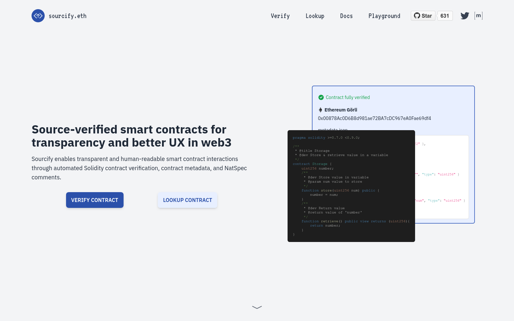
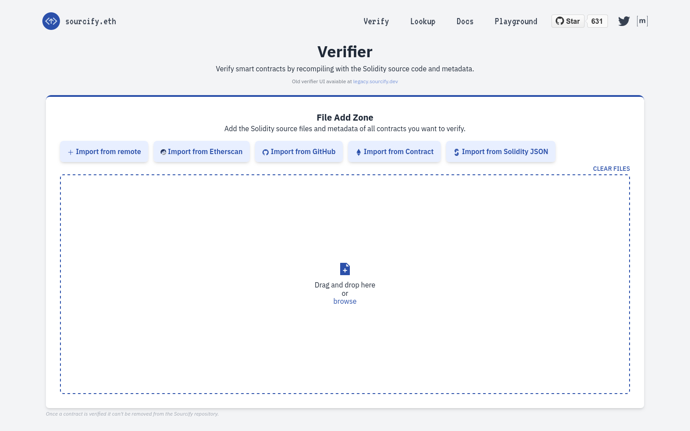
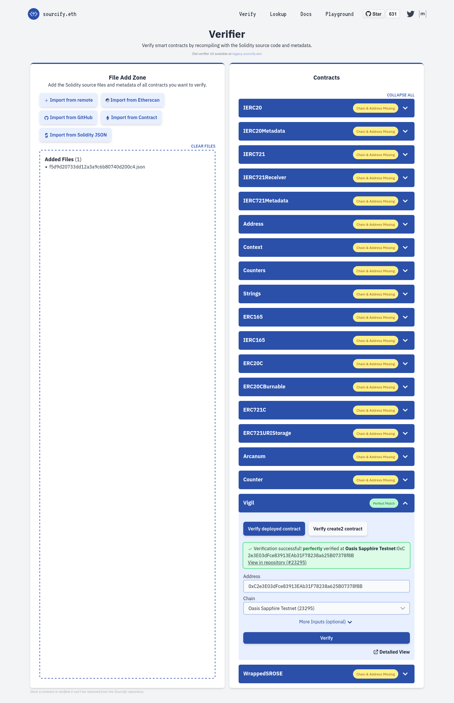

import DocCard from '@theme/DocCard';
import {findSidebarItem} from '@site/src/sidebarUtils';

# Guide

This page mainly describes the differences between Sapphire and Ethereum
since there are a number of excellent tutorials on developing for Ethereum.
If you don't know where to begin, the [Hardhat tutorial], [Solidity docs], and
[Emerald dApp tutorial] are great places to start. You can continue following
this guide once you've set up your development environment and have deployed
your contract to a non-confidential EVM network (e.g., Ropsten, Emerald).


[Hardhat tutorial]: https://hardhat.org/tutorial
[Solidity docs]: https://docs.soliditylang.org/en/v0.8.15/solidity-by-example.html
[Emerald dApp tutorial]: https://github.com/oasisprotocol/docs/blob/main/docs/dapp/emerald/writing-dapps-on-emerald.mdx

## Oasis Consensus Layer and Sapphire ParaTime

The Oasis Network consists of the consensus layer and a number of ParaTimes.
ParaTimes are independent replicated state machines that settle transactions
using the consensus layer (to learn more, check the [Oasis Network
Overview][overview chapter]). Sapphire is a ParaTime which implements the
Ethereum Virtual Machine (EVM).

The minimum and also expected block time in Sapphire is **6 seconds**. Any
Sapphire transaction will require at least this amount of time to be executed,
and probably no more.

ParaTimes, Sapphire included, are not allowed to directly access your tokens
stored in consensus layer accounts. You will need to _deposit_ tokens from your
consensus account to Sapphire. Consult the [Manage your
Tokens][how-to-deposit-rose] chapter to learn more.


[overview chapter]: https://github.com/oasisprotocol/docs/blob/main/docs/general/oasis-network/README.mdx
[how-to-deposit-rose]: https://github.com/oasisprotocol/docs/blob/main/docs/general/manage-tokens/README.mdx#rose-and-the-paratimes
[Testnet faucet]: https://faucet.testnet.oasis.io/

## Testnet and Mainnet

Sapphire is deployed on Testnet and Mainnet chains. Testnet should be
considered unstable software and may also have its state wiped at any time. As
the name implies, only use Testnet for testing unless you're testing how
angry your users get when state is wiped.

:::danger Never deploy production services on Testnet

Because Testnet state can be wiped in the future, you should **never** deploy a
production service on Testnet! Just don't do it!

Also note that while Testnet does use proper TEEs, due to experimental
software and different security parameters, **confidentiality of Sapphire on
Testnet is not guaranteed** -- all transactions and state published on the
Sapphire Testnet should be considered public.

:::

:::tip

For testing purposes, visit our [Testnet faucet] to obtain some TEST which you
can then use on the Sapphire Testnet to pay for gas fees. The faucet supports
sending TEST both to your consensus layer address or to your address inside the
ParaTime.

:::

[network-parameters]: https://github.com/oasisprotocol/docs/blob/main/docs/node/mainnet/README.md
[Testnet]: https://github.com/oasisprotocol/docs/blob/main/docs/node/testnet/README.md

## Sapphire vs Ethereum

Sapphire is generally compatible with Ethereum, the EVM, and all the user and
developer tooling that you are used to. In addition to confidentiality
features, you get a few extra benefits including the ability to **generate
private entropy**, and **make signatures on-chain**. An example of a dApp that
uses both is an HSM contract that generates an Ethereum wallet and signs
transactions sent to it via transactions.

There are also a few breaking changes compared to Ethereum though, but we think
that you'll quickly grasp them:

- [Encrypted Contract State](#encrypted-contract-state)
- [End-to-End Encrypted Transactions and Calls](#end-to-end-encrypted-transactions-and-calls)
- [`from` Address is Zero for Unsigned Calls](#from-address-is-zero-for-unsigned-calls)
- [Override `receive` and `fallback` when Funding the Contract](#override-receive-and-fallback-when-funding-the-contract)
- [Instant Finality](#instant-finality)

Read below to learn more about them. Otherwise, Sapphire is like Emerald, a
fast, cheap Ethereum.

### Encrypted Contract State

The contract state is only visible to the contract that wrote it. With respect
to the contract API, it's as if all state variables are declared as `private`,
but with the further restriction that not even full nodes can read the values.
Public or access-controlled values are provided instead through explicit
getters.

Calling `eth_getStorageAt()` will return zero.

### End-to-End Encrypted Transactions and Calls

Transactions and calls are end-to-end encrypted into the contract. Only the
caller and the contract can see the data sent to/received from the ParaTime.
This ends up defeating some utility of block explorers, however.

The status of the transaction is public and so are the error code, the revert
message and logs (emitted events).

### `from` Address is Zero for Unsigned Calls

The `from` address using of calls is derived from a signature attached to the
call. Unsigned calls have their sender set to the zero address. This allows
contract authors to write getters that release secrets to authenticated callers
(e.g. by checking the `msg.sender` value), but without requiring a transaction
to be posted on-chain.

### Override `receive` and `fallback` when Funding the Contract

In Ethereum, you can fund a contract by sending Ether along the transaction in
two ways:

1. a transaction must call a *payable* function in the contract, or
2. not calling any specific function (i.e. empty *calldata*). In this case,
   the payable `receive()` and/or `fallback()` functions need to be defined in
   the contract. If no such functions exist, the transaction will revert.

The behavior described above is the same in Sapphire when using EVM transactions
to fund a contract.

However, the Oasis Network also uses [Oasis-native transactions] such as a
deposit to a ParaTime account or a transfer. In this case, **you will be able to
fund the contract's account even though the contract may not implement payable
`receive()` or `fallback()`!** Or, if these functions do exist, **they will not
be triggered**. You can send such Oasis-native transactions by using the [Oasis
CLI] for example.

[Oasis-native transactions]: https://github.com/oasisprotocol/docs/blob/main/docs/general/manage-tokens/README.mdx
[Oasis CLI]: https://github.com/oasisprotocol/cli/blob/master/docs/README.md

### Instant Finality

The Oasis Network is a proof of stake network where 2/3+ of the validator nodes
need to verify each block in order to consider it final. However, in Ethereum
the signatures of those validator nodes can be submitted minutes after the block
is proposed, which makes the block proposal mechanism independent of the
validation, but adds uncertainty if and when will the proposed block actually be
finalized.

In the Oasis Network, the 2/3+ of signatures need to be provided immediately
after the block is proposed and **the network will halt, until the required
number signatures are provided**. This means that you can rest assured that any
validated block is final. As a consequence, the cross-chain bridges are more
responsive yet safe on the Oasis Network.

## Integrating Sapphire

Once ROSE tokens are [deposited into Sapphire][how-to-deposit-rose], it should
be painless for users to begin using dApps. To achieve this ideal user
experience, we have to modify the dApp a little, but it's made simple by our
compatibility library, [@oasisprotocol/sapphire-paratime].

There are compatibility layers in other languages, which may be found in [the repo].

[@oasisprotocol/sapphire-paratime]: https://www.npmjs.com/package/@oasisprotocol/sapphire-paratime
[the repo]: https://github.com/oasisprotocol/sapphire-paratime/tree/main/clients

## Writing Secure dApps

### Wallets

Sapphire is compatible with popular self-custodial wallets including MetaMask,
Ledger, Brave, and so forth. You can also use libraries like Ethers and Viem
to create programmatic wallets. In general, if it generates secp256k1 signatures,
it'll work just fine.

### Languages & Frameworks

Sapphire is programmable using any language that targets the EVM, such as Solidity,
Fe or Vyper. If you prefer to use an Ethereum framework like Hardhat or Foundry,
you can also use those with Sapphire; all you need to do is set your Web3 gateway URL.
You can find the details of the Oasis Sapphire Web3 endpoints
[here](https://github.com/oasisprotocol/docs/blob/main/docs/dapp/sapphire/README.mdx#rpc-endpoints).

### Transactions & Calls

<!-- https://github.com/oasisprotocol/docs/blob/455980674563cad92ff1e1b62a7a5f2d4d6809f0/docs/general/images/architecture/client-km-compute.svg -->


The figure above illustrates the flow of a **confidential smart contract
transaction** on Sapphire.

Transactions and calls must be encrypted and signed for maximum security.
The [@oasisprotocol/sapphire-paratime] npm package will make your life
easy. It'll handle cryptography and signing for you.

You should be aware that taking actions based on the value of private data may
**leak the private data through side channels** like time spent, gas use and
accessed memory locations. If you need to branch on private data, you should in
most cases ensure that both branches exhibit the same time/gas and storage
patterns.

You can also make **confidential smart contract calls** on Sapphire. If you
use `msg.sender` for access control in your contract, the call **must be
signed**, otherwise `msg.sender` will be zeroed. On the other hand, set the
`from` address to all zeros, if you want to avoid annoying signature popups in
the user's wallet for calls that do not need to be signed. The JS library will
do this for you.

:::note

Inside the smart contract code, there is no way of knowing whether the
client's call data were originally encrypted or not.

:::

<details>
  <summary>Detailed confidential smart contract transaction flow on Sapphire</summary>


</details>

<details>
  <summary>Detailed confidential smart contract call flow on Sapphire</summary>


</details>

### Contract State

The Sapphire state model is like Ethereum's except for all state being encrypted
and not accessible to anyone except the contract. The contract, executing in an
active (attested) Oasis compute node is the only entity that can request its
state encryption key from the Oasis key manager. Both the keys and values of the
items stored in state are encrypted, but the **size of either is not hidden**. Your
app may need to pad state items to a constant length, or use other obfuscation.
Observers may also be able to infer computation based on storage access patterns,
so you may need to obfuscate that, too. See [Security chapter] for more
recommendations.

[Security chapter]: ./security.md#storage-access-patterns

:::danger Contract state leaks a fine-grained access pattern

Contract state is backed by an encrypted key-value store. However, the trace of
encrypted records is leaked to the compute node. As a concrete example, an ERC-20
token transfer would leak which encrypted record is for the sender's account
balance and which is for the receiver's account balance. Such a token would be
traceable from sender address to receiver address. Obfuscating the storage access
patterns may be done by using an ORAM implementation.

:::

Contract state may be made available to third parties through logs/events, or
explicit getters.

### Contract Logs

Contract logs/events (e.g., those emitted by the Solidity `emit` keyword)
are exactly like Ethereum. Data contained in events is *not* encrypted.
Precompiled contracts are available to help you encrypt data that you can
then pack into an event, however.

:::danger Unmodified contracts may leak state through logs

Base contracts like those provided by OpenZeppelin often emit logs containing
private information. If you don't know they're doing that, you might undermine
the confidentiality of your state. As a concrete example, the ERC-20 spec
requires implementers to emit an `event Transfer(from, to, amount)`, which is
obviously problematic if you're writing a confidential token. What you can
do instead is fork that contract and remove the offending emissions.

:::

## Contract Verification

[Sourcify] is the preferred service for the [verification of smart
contracts][ethereum-contract-verify] deployed on Sapphire. Make sure you have
the **address of each deployed contract** available (your deployment scripts
should report those) and the **contracts JSON metadata file** generated when
compiling contracts (Hardhat stores it inside the `artifacts/build-info` folder
and names it as a 32-digit hex number). If your project contains multiple
contracts, you will need to verify each contract separately.

:::warning Contract deployment encryption

**Do not deploy your contract with an encrypted contract deployment transaction,
if you want to verify it.** For example, if your `hardhat.config.ts`
or deployment script contains `import '@oasisprotocol/sapphire-hardhat'` or
`import '@oasisprotocol/sapphire-paratime'` lines at the beginning, you should
comment those out for the deployment.

Verification services will try to match the contract deployment transaction code
with the one in the provided contract's metadata and since the transaction was
encrypted with an ephemeral ParaTime key, the verification service will not be
able to decrypt it. Some services may extract the contract's bytecode from the
chain directly by calling `eth_getCode` RPC, but this will not work correctly
for contracts with immutable variables.

:::

To verify a contract deployed on Sapphire Mainnet or Testnet:

1. Visit the [Sourcify] website and hit the "VERIFY CONTRACT" button.

   

2. Upload the contracts JSON metadata file.

   

   :::tip Store your metadata files

   For production deployments, it is generally a good idea to **archive your
   contract metadata JSON file** since it is not only useful for the
   verification, but contains a copy of all the source files, produced bytecode,
   an ABI, compiler and other relevant contract-related settings that may be
   useful in the future. Sourcify will store the metadata file for you and will
   even make it available via IPFS, but it is still a good idea to store it
   yourself.

   :::

3. Sourcify will decode the metadata and prepare a list of included contracts on
   the right. Enter the address of the specific contract and select the "Oasis
   Sapphire" or "Oasis Sapphire Testnet" chain for Mainnet or Testnet
   accordingly. If your contract assigns any immutable variables in the
   constructor, you will also need to correctly fill those out under the "More
   Inputs (optional)" panel. Finally, click on the "Verify" button.

   

4. If everything goes well, you will get a *Perfect match* notice and your
   contract is now verified. Congratulations!

In case of a *Partial match*, the contracts metadata JSON differs from the one
used for deployment although the compiled contract bytecode matched. Make sure
the source code `.sol` file of the contract is the same as the one used during the
deployment (including the comments, variable names and source code file
names) and use the same version of Hardhat and solc compiler.

You can also explore other verification methods on Sourcify by reading the
[official Sourcify contract verification instructions][sourcify-contract-verify].

[Sourcify]: https://sourcify.dev/
[hardhat-example]: https://github.com/oasisprotocol/sapphire-paratime/tree/main/examples/hardhat
[sourcify-contract-verify]: https://docs.sourcify.dev/docs/how-to-verify/
[ethereum-contract-verify]: https://ethereum.org/en/developers/docs/smart-contracts/verifying/

## Running a Private Oasis Network Locally

For convenient development and testing of your dApps the Oasis team prepared
the [ghcr.io/oasisprotocol/sapphire-localnet][sapphire-localnet] Docker image
which brings you a complete Oasis network stack to your desktop. The Localnet
Sapphire instance **mimics confidential transactions**, but it does not run in a
trusted execution environment nor does it require Intel's SGX on your computer.
The network is isolated from the Mainnet or Testnet and consists of a:

- single Oasis validator node with 1-second block time and 30-second epoch,
- single Oasis client node,
- single compute node running Oasis Sapphire,
- single key manager node,
- PostgreSQL instance,
- Oasis Web3 gateway with transaction indexer and enabled Oasis RPCs,
- helper script which populates the account(s) for you.

To run the image, execute:

```sh
docker run -it -p8545:8545 -p8546:8546 ghcr.io/oasisprotocol/sapphire-localnet
```

After a while, the tool will show you something like this:

```
sapphire-localnet 2024-05-28-git37b7166 (oasis-core: 24.0-gitfb49717, sapphire-paratime: 0.7.3-testnet, oasis-web3-gateway: 5.1.0)

 * Starting oasis-net-runner with sapphire...
 * Waiting for Postgres to start...
 * Waiting for Oasis node to start.....
 * Starting oasis-web3-gateway...
 * Bootstrapping network (this might take a minute)...
 * Waiting for key manager......
 * Populating accounts...

Available Accounts
==================
(0) 0x41b0C13e747F8Cb1c4E980712504437cb1792327 (10000 TEST)
(1) 0xa521f94f8a38b1d027D526017EB229327B9D6cA0 (10000 TEST)
(2) 0x1e0f8369215D6C5Af5E14eD6A0D6ae7372776A79 (10000 TEST)
(3) 0xB60cA28B491747a27C057AdBF3E71F3CCC52332C (10000 TEST)
(4) 0x88D7d924e521a6d07008a373D5b33281148ffEDc (10000 TEST)

Private Keys
==================
(0) 0x617346c545d62b8213ea907acf1b570a7405683e2c6dcaf963fc21fd677e0c56
(1) 0xf82d6e09208b0bd44a397f7e73b05c564e6c9f70b151ee7677e2bb8d6ce5d882
(2) 0xeb2f21d20086f3dd6bfe7184dad1cb8b0fb802f27b1334e836a19eda0a43a1c2
(3) 0x82b0203d6063992b1052004b90411c45d4f3afab696346f006e74c6abd8f855e
(4) 0x7179c6e1add3a2993822653b9c98fe606f47fb6d4c0d0d81b31b067cf6bb5f83

HD Wallet
==================
Mnemonic:       coach genre beach child crunch champion tell adult critic peace canoe stable
Base HD Path:   m/44'/60'/0'/0/%d

WARNING: The chain is running in ephemeral mode. State will be lost after restart!

 * Listening on http://localhost:8545 and ws://localhost:8546. Chain ID: 0x5afd
 * Container start-up took 66 seconds, node log level is set to warn.
```

Those familiar with local dApp environments will find the output above similar
to `geth --dev` or `ganache-cli` commands or the `geth-dev-assistant` npm
package. [sapphire-localnet] will spin up a private Oasis Network locally,
generate and populate test accounts and make the following Web3 endpoints
available for you to use:

- `http://localhost:8545`
- `ws://localhost:8546`

:::tip

If you prefer using the same mnemonics each time (e.g. for testing purposes)
or to populate just a single account, use `-to` flag and pass the mnemonics or
the wallet addresses. By passing the `-test-mnemonic` flag you can fund the
standard test accounts provided by the `hardhat node` commmand and that are
typically used for solidity unit tests.

```sh
docker run -it -p8545:8545 -p8546:8546 ghcr.io/oasisprotocol/sapphire-localnet -to "bench remain brave curve frozen verify dream margin alarm world repair innocent" -n3
docker run -it -p8545:8545 -p8546:8546 ghcr.io/oasisprotocol/sapphire-localnet -to "0x75eCF0d4496C2f10e4e9aF3D4d174576Ee9010E2,0xbDA5747bFD65F08deb54cb465eB87D40e51B197E"
docker run -it -p8545:8545 -p8546:8546 ghcr.io/oasisprotocol/sapphire-localnet -test-mnemonic
```

:::

:::note Running on Apple M chips

There is currently no `arm64` build available for M Macs, so you will need to
force the docker image to use the `linux/x86_64` platform, like this:

```sh
docker run -it -p8545:8545 -p8546:8546 --platform linux/x86_64 ghcr.io/oasisprotocol/sapphire-localnet
```

:::

:::danger

[sapphire-localnet] runs in ephemeral mode. Any smart contract and wallet balance
will be lost after you quit the Docker container!

:::

[sapphire-localnet]: https://github.com/oasisprotocol/oasis-web3-gateway/pkgs/container/sapphire-localnet

## See also

<DocCard item={findSidebarItem('/node/run-your-node/paratime-client-node')} />
<DocCard item={findSidebarItem('/node/web3')} />
