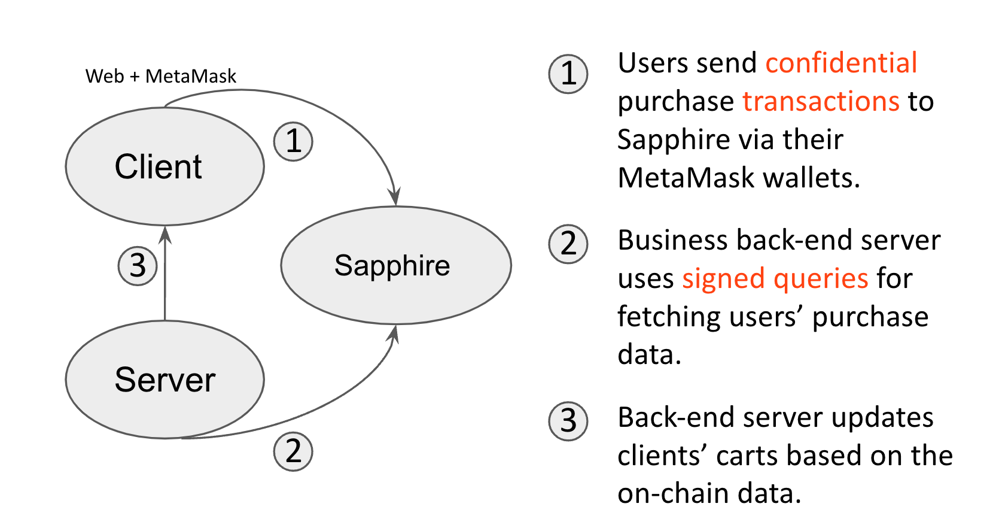

# Simple Sapphire Tutorial with Confidential Payment

## A Simple E-Commerce D-App



1. Deploy contracts to Ganache
```console
cd tutorial/e-commerce
truffle migrate --reset --network development
```

2. Start server
```console
cd tutorial/e-commerce/server
npm run start
```

3. Start client
```console
cd tutorial/e-commerce/client
npm run start
```

## Sapphire Deployment

Uncomment the following codes in `truffle-config.js`

```
const HDWalletProvider = require('@truffle hdwallet-provider');                                                                                                                               
const Sapphire = require('@oasisprotocol/sapphire-paratime');  
```

```
sapphire_testnet: {                                                                                                                                                                      
    url: "https://testnet.sapphire.oasis.dev:8545",                                                                                                                                        
        provider: function() {                                                                                                                                                                 
            var provider = new HDWalletProvider(process.env.PRIVATE_KEY, "https://testnet.sapphire.oasis.dev");                                                                                    
                return Sapphire.wrap(provider)                                                                                                                                                        
        },                                                                                                                                                                                    
    gas: 4700000,                                                                                                                                                                          
    network_id: "*"                                                                                                                                                                        
},  
```

Deploy contracts to Sapphire Testnet

```console
PRIVATE_KEY="YOUR_TESTNET_PRIVATE_KEY" truffle migrate --network sapphire_testnet
```

## Making Sapphire Transactions via MetaMask

Uncomment/modify the following codes in `server/app.js`

```
var Sapphire = require('@oasisprotocol/sapphire-paratime');
```

```
var endpoint = 'https://testnet.sapphire.oasis.dev';
var networkId = 23295;
```

```
var signer = Sapphire.wrap(myWallet);
```

Restart the server:

```console
npm run start
```

## Making Sapphire Signed Queries on Server Side

Uncomment/modify the following codes in `client/src/App.js`

```
import * as Sapphire from '@oasisprotocol/sapphire-paratime';
```

```
const provider = Sapphire.wrap(window.ethereum);
```

Restart the client:

```console
npm run start
```